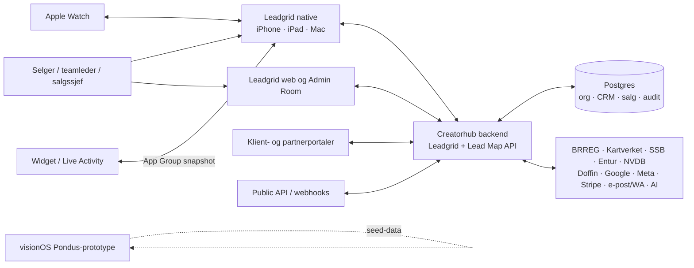

# Leadgrid: produkt- og plattformkart

**Verifisert mot kode:** 29. august 2026

## Produktets jobb

Leadgrid er en operativ arbeidsflate fra første prospekt til vunnet eller tapt
salg. Produktet samler:

- oppdagelse og beriking av bedrifter;
- kart, territorier, dagsruter og feltbesøk;
- lead-, møte-, pipeline- og oppfølgingsarbeid;
- teamledelse, coaching, provisjon og kvalitetssikring;
- salgsmetodikk og læring gjennom Leadbook og Pondus;
- automatisering, rapportering, varsler, integrasjoner og API;
- tilleggstjenester som Leadgrid Go, Doffin/Anbud og Canvas.

Admin Workspace er ikke en del av denne produktflyten. Det brukes internt til
produktarbeid, finansiering, dokumentasjon og andre administrative initiativer.

## Systemkart

Heltrukket linje betyr en aktiv dataforbindelse i kildekoden. Den stiplede
visionOS-linjen er bevisst: Vision-målet bruker foreløpig seed-data, ikke den
delte produksjonsklienten.

## Plattformmatrise

| Plattform | Primær bruk | Data og synk | Status |
|---|---|---|---|
| iPhone | Feltarbeid, kart, leads, møter og «Mer»-inngang til alle hovedmoduler | Direkte API, WebSocket/polling, offline-kø og Watch-bro | Aktiv; enkelte undersider er hybride |
| iPad portrait | Samme bottom-tab-opplevelse som iPhone, med større arbeidsflate | Samme API og offline-mekanismer | Aktiv |
| iPad landscape | Sidebar med 12 hovedområder og detaljkolonne | Samme API; aktiv org styrer scope | Aktiv |
| Mac Catalyst | iPad-opplevelse med tastatursnarveier og Mac-tilpasninger | Samme API | Aktiv · betinget av Catalyst-bygg |
| Apple Watch | Nærmeste leads, hurtighandlinger, diktert hurtignotat og Pondus-lynkort | WatchConnectivity via iPhone; lokalt snapshot og køet retur | Aktiv · avhengig av paret iPhone |
| Widget | Stille leads, follow-ups, møter og dagens elementer | Delt App Group-snapshot; timeline hvert 15. minutt | Aktiv når hovedappen har skrevet snapshot |
| Live Activity | Pågående besøk på låseskjerm og Dynamic Island | ActivityKit-state fra hovedappen | Aktiv · støttet enhet/OS |
| visionOS | Pondus-mal, score, steg og spatial coach | Eget seed-datasett; ingen delt produksjonsauth/API ennå | Demo/prototype |
| Web / Admin Room | Lead Map, CRM-operasjoner, oppsett, rapporter, integrasjoner og superadmin | Direkte API | Blandet: aktiv produktflate, adminverktøy og offentlige sider |
| Offentlige portaler | Klientinnsyn, forslag, partner-, utvikler-, demo- og registreringsflyter | Token, offentlig skjema eller partner/API-nøkkel | Offentlig flate; varierer per portal |

## Aktiv hovednavigasjon

### iPhone og iPad portrait

Bottom tabs:

1. **Oversikt** – dagens salgstilstand, momentum og nøkkeltall.
2. **Kart** – leads, posisjon, besøk, rute, områder og kartverktøy.
3. **Leads** – bedrifts-CRM. Skjules for organisasjoner i ren dørsalgsprofil
   når `leads` ikke er tilgjengelig.
4. **Møter** – kalender, forberedelse, gjennomføring og etterarbeid.
5. **Mer** på iPhone – inngang til Team, Leadbook, Salgsledelse, Leadgrid Go,
   Kvalitet, Anbud, Canvas og Verktøy.

På iPad portrait vises Team, Leadbook og Salgsledelse som egne faner i stedet
for iPhones samlefane.

### iPad landscape og Mac Catalyst

Sidebaren inneholder:

- Oversikt
- Kart
- Leads
- Møter
- Team
- Leadbook
- Salgsledelse
- Leadgrid Go
- Kvalitet
- Anbud
- Canvas
- Verktøy

Salgsledelse skjules for brukere som ikke er `admin` eller `salgssjef`.
Leads og Canvas kan skjules av organisasjonens entitlement/profil.

Mac Catalyst har disse snarveiene:

| Snarvei | Handling |
|---|---|
| `⌘1`–`⌘7` | Bytt mellom de første hovedområdene. |
| `⌘,` | Åpne innstillinger via globalt app-signal. |
| `⌘N` | Bytt til Kart og start «ny lead». |
| `⌘K` | Bytt til Leads og fokuser søk. |
| `⌘F` | Fokuser søk i gjeldende støttede flate. |

### Verktøy-huben

Verktøy er inngangen til funksjoner som ikke er egne toppnivåfaner:

- mine tildelte leads;
- vunnet/tapt-dashboard;
- per-lead AI-research;
- Market Scan;
- dagsrute;
- pipeline-kanban og Next Best Action;
- analyse-dashboard;
- varselinnboks og varselpreferanser;
- onboarding av e-post/WhatsApp-kanaler;
- planlagte rapporter og CSV-eksport;
- partnerprogram, faktura/abonnement og AI-kost;
- Super Admin for plattformadministrator.

## Roller, permissions og entitlements

Tre lag kan påvirke samme funksjon:

1. **Organisasjonsrolle** – Salgssjef, Teamleder, Selger eller Spectator.
2. **Permission** – server- og klientnøkler som `leads.view`,
   `territories.manage`, `workflows.execute` eller `forecasting.view`.
3. **Entitlement/plan** – `included`, `trial`, `add_on` eller `locked` per
   organisasjon og funksjonsnøkkel.

Superadmin kan ha bypass. Den generelle Leadgrid entitlement-vakten er
bakoverkompatibel og fail-open hvis en eldre organisasjon ikke har noen rad.
Dette er ikke universelt: lydopptak er eksplisitt fail-closed og krever at
organisasjonen har bekreftet compliance.

Standard rolleintensjon:

| Rolle | Normal tilgang |
|---|---|
| Salgssjef | Administrerer alle salgsflater, team, rapporter og tilganger. |
| Teamleder | Arbeider med eget team; mangler normalt fakturering og integrasjonsadmin. |
| Selger | Eget salgsarbeid; leser team/salgsledelse og Leadbook etter policy. |
| Spectator | Hovedsakelig lesetilgang; ingen tilganger, fakturering, integrasjoner eller varselsadmin. |

Se funksjonskatalogen for den konkrete funksjonen. Rolle-defaultene i den
native matrisen er ikke alene bevis på at alle backendruter håndhever samme
nivå; serverens permission-/entitlement-vakt er avgjørende.

## Organisasjon og datagrense

- Aktiv organisasjon bestemmer hvilke leads, teamdata, innstillinger og
  entitlements klienten henter.
- Superadmin kan velge solo-modus eller overstyre aktiv organisasjon gjennom
  egen org-override-flyt.
- Leadgrid bygger videre på `crm_customers`, men Leadgrid-data må fortsatt
  filtreres på eier/organisasjon og aktivt produktformål.
- Org-status (`paused`/`suspended`) håndheves på både
  `/api/admin-room/lead-map` og `/api/leadgrid`.

## Online, sanntid og offline

Den native appen bruker flere mekanismer samtidig:

| Mekanisme | Bruk |
|---|---|
| Vanlige API-kall | Lesing og mutasjoner mot Lead Map/Leadgrid-rutene. |
| Polling | Oppdaterer varsler og sentrale salgsdata etter innlogging. |
| WebSocket | Organisasjonskanal for blant annet `lead.created` og raske oppdateringer. |
| Offline action queue | Bufrer støttede handlinger og drenerer ved appstart eller gjenopprettet nett. |
| Offline cache | Gir lesbar tilstand for deler av appen uten nett. |
| WatchConnectivity | Sender snapshots/Pondus til Watch og køer hurtighandlinger tilbake. |
| App Group snapshot | Mater widgetene uten å åpne hovedappen. |

Ikke alle knapper bruker offline-kø. Dokumentasjonen skal derfor beskrive
offline-atferd per handling, ikke love generell offline-støtte for hele appen.

## Viktige eksterne avhengigheter

| Område | Tjeneste eller krav |
|---|---|
| Bedriftsdata | BRREG og nettstedanalyse |
| Kart/adresse | MapKit, Kartverket/Geonorge og SSB |
| Mobilitet | Entur, NVDB og offentlige parkeringsdata |
| Anbud | Doffin og CPV-katalog |
| AI | On-device Apple Intelligence der tilgjengelig, ellers backend-AI; enkelte flows bruker Claude/Whisper |
| Varsling | APNs, e-post, WhatsApp/Meta og eventuelt SMS/Twilio-konfigurasjon |
| Betaling | Stripe og manuell fakturaflyt for særskilte organisasjoner |
| Filer/media | Konfigurert objektlagring og signed URLs der funksjonen krever det |
| Rapport/eksport | Servergenerert CSV/PDF og native share sheet |

Manglende nøkkel eller leverandørtilgang kan gjøre en ellers aktiv flate
utilgjengelig. Det klassifiseres som «Aktiv · betinget», ikke som demo.

## Primære kodeinnganger

- Native app og navigasjon: `ipad/LeadMapApp/LeadMapApp/App/LeadMapApp.swift`
- Native tilstand og synk: `ipad/LeadMapApp/LeadMapApp/App/AppState.swift`
- Native API-klient: `ipad/LeadMapApp/LeadMapApp/Core/APIClient*.swift`
- Native funksjons-/rollematrise:
  `ipad/LeadMapApp/LeadMapApp/Views/Tabs/Leadbook/TeamAccessControl.swift`
- Native entitlement-store:
  `ipad/LeadMapApp/LeadMapApp/Views/Tabs/Leadbook/GatedView.swift`
- Watch: `ipad/LeadMapApp/LeadgridWatchApp/`
- Vision: `ipad/LeadMapApp/LeadgridVisionApp/`
- Widget/Live Activity: `ipad/LeadMapApp/LeadMapWidget/`
- Webkomponenter: `frontend/client/src/components/leadgrid/`
- Offentlige webflater: `frontend/client/src/pages/leadgrid-*.tsx`
- Servermontering: `backend/server/index.ts`
- Server-entitlement-vakt: `backend/server/leadgrid-entitlement-guard.ts`
- Organisasjonsoppslag: `backend/server/leadgrid-org-resolver.ts`

